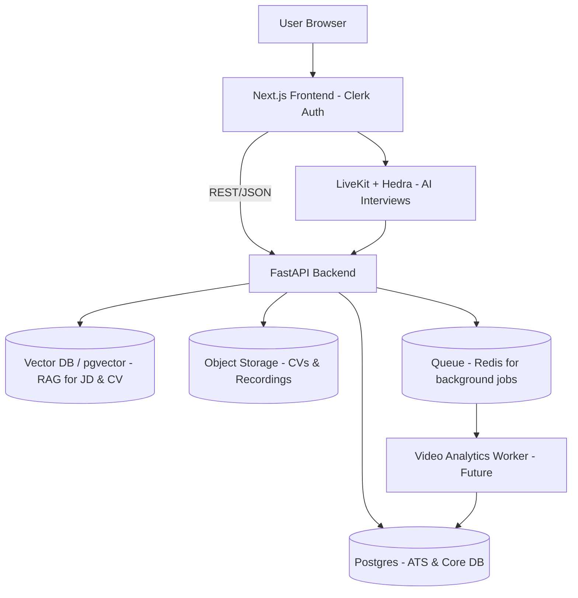

# Interviewly System Architecture

## Overview

Interviewly is a dual-sided platform that serves both job seekers (candidates) and recruiters/hiring managers. The platform provides AI-powered interview coaching, CV analysis, and an Applicant Tracking System (ATS) for recruiters.

---

## Architecture Diagram

---

## Tech Stack

### Frontend
- **Framework**: Next.js 14+ (App Router)
- **Authentication**: Clerk (single app for both roles)
- **Styling**: Tailwind CSS, Framer Motion
- **Icons**: Lucide React
- **Realtime**: LiveKit Client SDK + Hedra integration for AI interviews

### Backend
- **Framework**: FastAPI (Python)
- **ORM**: SQLAlchemy
- **Migrations**: Alembic (via `init_db()` for now)
- **HTTP Client**: httpx (for Clerk API calls)
- **Database**: PostgreSQL (with SQLite fallback for development)
- **Vector Search**: pgvector extension (for future RAG/embeddings)

### Realtime / Video
- **Platform**: LiveKit Cloud (or self-hosted)
- **AI Agent**: LiveKit Agents + Hedra for AI interviewer
- **Recording**: LiveKit recording service

### Data Storage
- **Database**: PostgreSQL (Neon or self-hosted)
- **Vector DB**: pgvector extension in Postgres (for embeddings)
- **Object Storage**: S3/R2 (for CV files and video recordings)

### Background Jobs (Future)
- **Queue**: Redis (for async processing)
- **Workers**: Python workers for:
  - CV-to-JD scoring (embeddings + RAG)
  - Video analytics (OpenCV/MediaPipe for eye contact, facial metrics)

---

## System Components

### 1. Authentication & User Management

**Single Clerk Application**
- One Clerk app handles authentication for both candidates and recruiters
- User roles stored in our database (`users.role`: `RECRUITER` | `CANDIDATE`)
- Clerk JWT tokens validated in backend via `ClerkAuthService`

**User Flow**:
1. User signs up/signs in via Clerk
2. Frontend calls `/api/auth/sync-user` to create/update user in our DB
3. User selects role on `/onboarding/role` page
4. Role stored in `users.role` and optionally in Clerk `publicMetadata`

### 2. Candidate Features

**Mock Interviews**
- Voice-enabled AI interviews via LiveKit + Hedra
- Real-time feedback and scoring
- Interview reports with strengths/weaknesses

**CV Tools**
- CV Analyzer: ATS scoring, keyword analysis
- CV Rewriter: Multiple styles (Modern, Minimal, Executive, ATS Optimized)
- AI Career Coach: Chat-based career guidance

### 3. Recruiter Features (ATS)

**Job Management**
- Create job postings with descriptions, requirements, salary ranges
- Job status: DRAFT, OPEN, PAUSED, CLOSED
- Skills extraction and weighting

**Application Tracking**
- Candidates apply to jobs (public endpoint)
- CV-to-JD scoring (placeholder now, RAG-based in future)
- Application status workflow: APPLIED → SCREENING → SHORTLISTED → INTERVIEW_SCHEDULED → OFFERED/REJECTED/HIRED

**Interview Management**
- Schedule interviews (HUMAN or AI)
- AI interviews use same LiveKit + Hedra pipeline as candidate mock interviews
- Interview metrics: overall score, eye contact, speech fluency, sentiment, engagement
- Recruiter feedback and ratings

### 4. Database Schema

**Core Tables**:
- `users`: User accounts with Clerk integration and roles
- `companies`: Company records
- `recruiter_profiles`: Recruiter profiles linked to users and companies

**ATS Tables**:
- `jobs`: Job postings
- `job_skills`: Skills required for jobs
- `candidates`: External candidate records (separate from users)
- `applications`: Job applications
- `screenings`: CV-to-JD screening results
- `interviews`: Interview records
- `interview_metrics`: AI/video analytics metrics
- `interview_feedback`: Human recruiter feedback

**Existing Tables** (for candidates):
- `interview_sessions`: Mock interview sessions
- `cv_analyses`: CV analysis results
- `cv_rewrites`: CV rewrite results
- `subscriptions`: User subscription plans

### 5. API Endpoints

**Authentication** (`/api/auth`):
- `POST /sync-user`: Sync user from Clerk
- `POST /set-role`: Set user role
- `GET /me`: Get current user info

**ATS** (`/api/ats/v1`):
- `POST /jobs`: Create job (RECRUITER only)
- `GET /jobs`: List jobs (RECRUITER only)
- `GET /jobs/{job_id}`: Get job details
- `POST /jobs/{job_id}/apply`: Apply to job (public)
- `GET /jobs/{job_id}/applications`: List applications (RECRUITER only)
- `POST /applications/{application_id}/interviews`: Schedule interview
- `GET /applications/{application_id}/interviews`: List interviews

**Existing Endpoints**:
- `/interview/*`: Mock interview endpoints
- `/cv/*`: CV analysis endpoints
- `/livekit/*`: LiveKit token generation

---

## Cost Considerations

### Current Cost Drivers

1. **LiveKit**
   - Video minutes: ~$0.004/minute
   - Recording storage: ~$0.01/GB/month
   - **Control**: Limit interview duration, auto-delete old recordings

2. **LLM Usage (OpenAI)**
   - GPT-4o: ~$2.50/1M input tokens, $10/1M output tokens
   - Used for: CV analysis, CV rewriting, career coach, interview feedback
   - **Control**: Cache results, use GPT-4o-mini for simpler tasks

3. **Embeddings (Future)**
   - text-embedding-3-large: ~$0.13/1M tokens
   - Used for: CV-to-JD matching, semantic search
   - **Control**: Cache embeddings, only re-embed when CV/JD changes

4. **Object Storage**
   - S3/R2: ~$0.023/GB/month
   - Used for: CV files, video recordings
   - **Control**: Lifecycle policies, compress videos

5. **Database**
   - Neon Postgres: Free tier available, then ~$19/month
   - **Control**: Use free tier for early stage, optimize queries

### Cost Optimization Strategies

1. **Interview Limits**
   - Free tier: 3 interviews/month
   - Pro tier: Unlimited
   - Auto-stop interviews after 30 minutes

2. **Caching**
   - Cache CV embeddings (only re-embed on CV update)
   - Cache JD embeddings (only re-embed on JD update)
   - Cache interview reports

3. **Selective Processing**
   - Only run video analytics on shortlisted candidates
   - Use lighter models (GPT-4o-mini) for simple tasks
   - Batch process CV analyses during off-peak hours

4. **Storage Lifecycle**
   - Auto-delete recordings after 90 days
   - Compress videos before storage
   - Archive old applications to cold storage

---

## Future Enhancements

### Phase 2: Advanced ATS Features
- **CV-to-JD Scoring**: RAG-based matching using embeddings
- **Bulk Upload**: CSV/Excel import for candidates
- **Screening Dashboards**: Visual analytics for application pipelines
- **Email Notifications**: Automated emails for status changes

### Phase 3: Video Analytics
- **Eye Contact Detection**: OpenCV/MediaPipe analysis
- **Speech Fluency**: Real-time analysis during interviews
- **Sentiment Analysis**: Tone and engagement scoring
- **Facial Metrics**: Confidence, nervousness indicators

### Phase 4: Advanced Features
- **Multi-company Support**: Recruiters can belong to multiple companies
- **Team Collaboration**: Shared candidate notes, team feedback
- **Integration APIs**: Webhook support, Zapier integration
- **Mobile Apps**: React Native apps for candidates and recruiters

---

## Deployment

### Recommended Stack

**Frontend**:
- Vercel (Next.js optimized)
- Environment: `NEXT_PUBLIC_API_URL`, `NEXT_PUBLIC_CLERK_PUBLISHABLE_KEY`

**Backend**:
- Railway / Render / Fly.io
- Environment: `DATABASE_URL`, `CLERK_SECRET_KEY`, `OPENAI_API_KEY`, `LIVEKIT_*`

**Database**:
- Neon Postgres (managed, with pgvector support)

**Storage**:
- Cloudflare R2 or AWS S3

**Realtime**:
- LiveKit Cloud (or self-hosted on Fly.io)

---

## Security Considerations

1. **Authentication**: All protected routes require valid Clerk JWT
2. **Role-Based Access**: ATS endpoints require `RECRUITER` role
3. **Data Isolation**: Recruiters can only see their own jobs/applications
4. **File Upload**: Validate file types, scan for malware
5. **Rate Limiting**: Implement rate limits on API endpoints
6. **CORS**: Restrict CORS to frontend domain in production

---

## Monitoring & Observability

**Recommended Tools**:
- **Logging**: Structured logs (JSON) to stdout, collected by platform
- **Error Tracking**: Sentry for frontend and backend
- **Analytics**: PostHog or Mixpanel for user behavior
- **APM**: Datadog or New Relic for backend performance
- **Database**: Neon dashboard for query performance

---

## Development Workflow

1. **Local Development**:
   - Frontend: `npm run dev` (port 3000)
   - Backend: `uvicorn app.main:app --reload` (port 8000)
   - Database: SQLite for dev, Postgres for staging/prod

2. **Migrations**:
   - Currently using `init_db()` to create tables
   - Future: Add Alembic for proper migrations

3. **Testing**:
   - Unit tests for services
   - Integration tests for API endpoints
   - E2E tests for critical flows (Playwright)

---

## Notes

- **Single Clerk App**: We use one Clerk application for both candidates and recruiters. Roles are managed in our database.
- **Role Selection**: Users select their role on first sign-in via `/onboarding/role`.
- **Dual Usage**: Currently, users can only have one role. Future: allow users to switch roles or have both.
- **CV-to-JD Scoring**: Currently placeholder (random 50-90 score). Future: RAG-based using embeddings.
- **Video Analytics**: Not yet implemented. Future: OpenCV/MediaPipe worker for eye contact, speech analysis.

---

**Last Updated**: 2024
**Version**: 1.0.0 (Phase 1 - Dual-Sided Platform)

